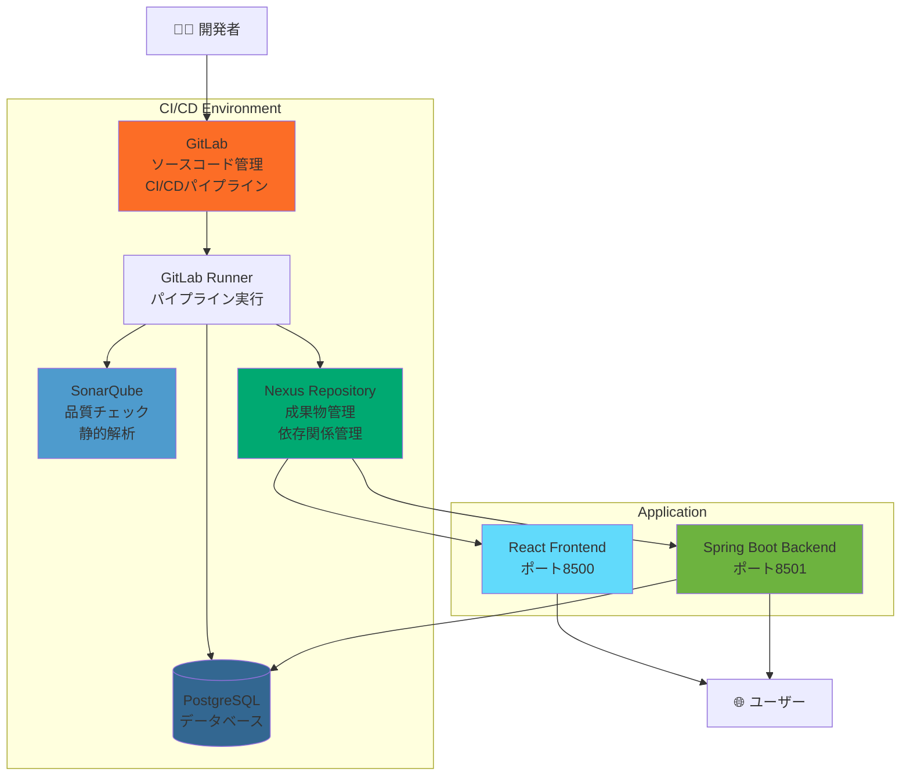
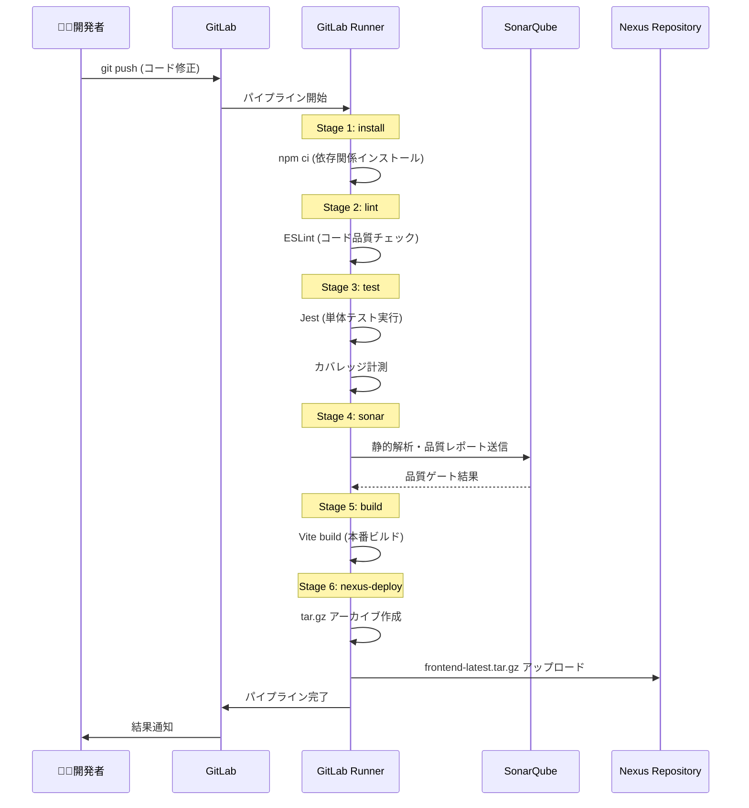
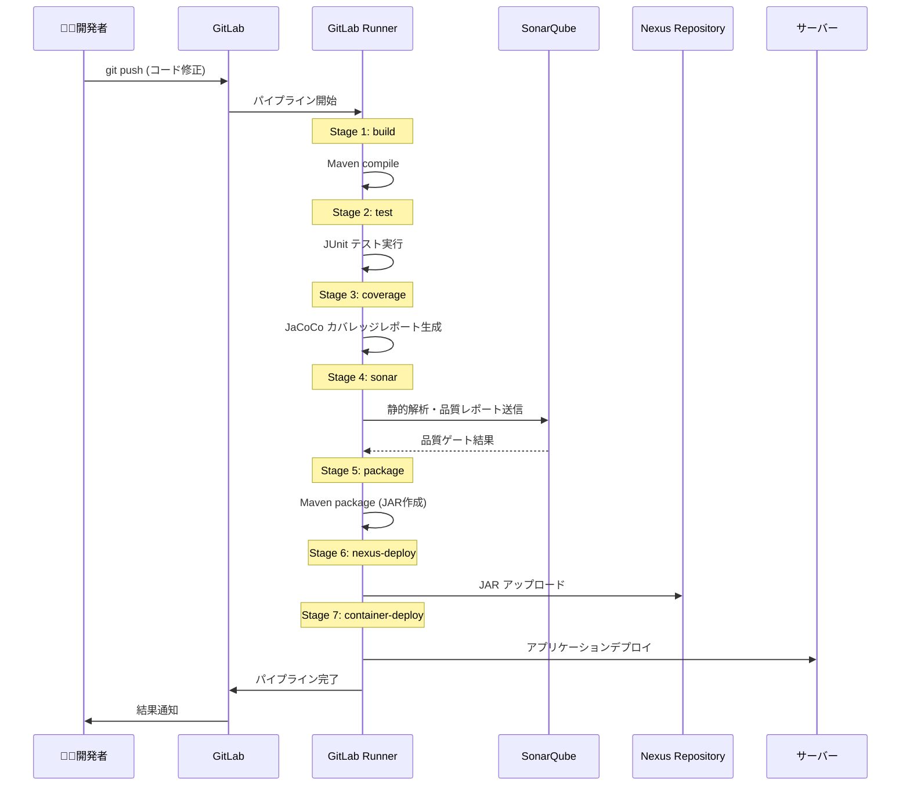
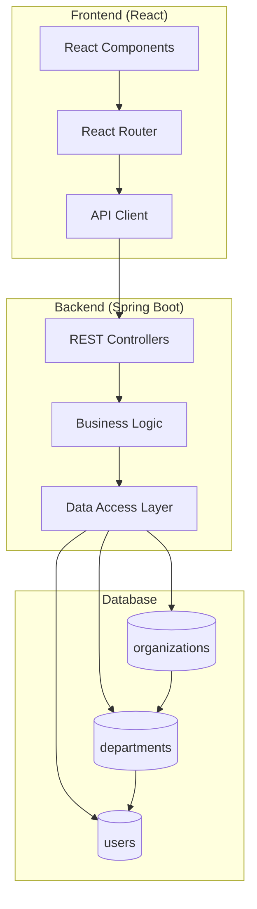
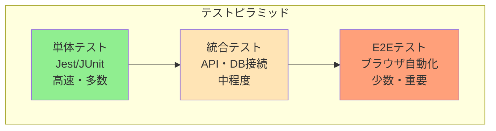

# CI/CD学習環境ガイド

## 概要

この環境は、**CI/CD（継続的インテグレーション・継続的デリバリー）** の流れとテストケース作成、アプリケーション開発を総合的に学習するための実践的な環境です。

### 学習範囲

**学習者が実行する操作**:
- ✅ **GitLabリポジトリ操作** - clone, commit, push
- ✅ **コード修正・テストケース作成** - 機能追加・品質向上
- ✅ **CI/CD管理画面閲覧** - パイプライン結果・品質レポート・成果物確認

**管理者が実行する操作**:
- ❌ サーバー管理・スクリプト実行
- ❌ アプリケーションデプロイ・起動停止
- ❌ 環境構築・設定変更

### 学習目標

- **CI/CDパイプライン** の理解と実践
- **品質管理プロセス** （テスト、静的解析、カバレッジ）
- **成果物管理** （Nexusを使った依存関係・アーティファクト管理）
- **フルスタックWeb開発** （Spring Boot + React）
- **DevOpsツールチェーン** の実際の使用方法

---

## 🔗 サービスアクセス情報

### 各サービスURL・ログイン情報

| サービス | URL | ユーザー名 | 用途 |
|----------|-----|------------|------|
| **GitLab** | http://${EC2_PUBLIC_IP}:5003 | `root` | ソースコード管理・CI/CD |
| **SonarQube** | http://${EC2_PUBLIC_IP}:8000 | `admin` | 品質・静的解析 |
| **Nexus Repository** | http://${EC2_PUBLIC_IP}:8082 | `admin` | 成果物・依存関係管理 |
| **pgAdmin** | http://${EC2_PUBLIC_IP}:5002 | `admin@example.com` | データベース管理UI |

### PostgreSQL データベース接続情報（pgAdmin用）

| データベース名 | ユーザー名 | 用途 | 接続ホスト |
|----------------|------------|------|------------|
| **cicddb** | `cicduser` | メインCI/CD DB | `${EC2_PUBLIC_IP}:5001` |
| **gitlabhq** | `gitlab` | GitLabデータ | `${EC2_PUBLIC_IP}:5001` |
| **sonardb** | `sonaruser` | SonarQube解析DB | `${EC2_PUBLIC_IP}:5001` |
| **sampledb** | `sampleuser` | サンプルアプリDB | `${EC2_PUBLIC_IP}:5001` |

> ⚠️ **注意**: pgAdminでDB接続時、ユーザーIDとパスワードの入力を求められた場合があります

### アプリケーションURL

| アプリケーション | URL | 説明 |
|------------------|-----|------|
| **Frontend App** | http://${EC2_PUBLIC_IP}:3000 | React組織管理システム |
| **Backend API** | http://${EC2_PUBLIC_IP}:8501 | Spring Boot REST API |
| **Swagger UI** | http://${EC2_PUBLIC_IP}:8501/swagger-ui.html | API仕様・テスト画面 |

> ⚠️ **現在の制限事項**:
> - デプロイスクリプトによる自動反映は部分的対応（手動デプロイが必要）
> - Frontend-Backend間の通信設定に不備があり、画面にエラーが表示される場合があります

---

## システム構成

### 全体アーキテクチャ




## CI/CDパイプライン フロー

### Frontend パイプライン（6ステージ）



### Backend パイプライン（7ステージ）



---

## サンプルアプリケーション

### アーキテクチャ



### 技術スタック

**Frontend**:
- **React 18** - UIライブラリ
- **Vite** - ビルドツール
- **Jest** - テストフレームワーク
- **ESLint** - コード品質チェック

**Backend**:
- **Spring Boot 3.2** - Webアプリケーションフレームワーク
- **Java 17** - プログラミング言語
- **Maven** - ビルド・依存関係管理
- **JUnit 5** - テストフレームワーク
- **JaCoCo** - カバレッジ計測

**Database**:
- **PostgreSQL** - リレーショナルデータベース
- **Flyway** - データベースマイグレーション

### デプロイメント構成

**現在のデプロイフロー**:
```
CI/CD Pipeline → Nexus Repository → 手動デプロイスクリプト → アプリケーション
```

**デプロイ方法**:

管理者によるデプロイスクリプト実行でアプリケーションが起動されます。

**アプリケーション起動構成**:
- **Frontend**: Python3 HTTPサーバー（ポート3000）
- **Backend**: 既存Dockerコンテナ（ポート8501）

**制限事項・学習ポイント**:
- CI/CDパイプラインからの完全自動デプロイは未実装
- Frontend-Backend間のCORS設定に課題あり
- 実際の統合環境で発生する典型的な課題を体験可能

---

## 品質管理プロセス

### 品質ゲート設定

**コードカバレッジ**: 90%以上
**品質評価**: A以上
**重大な問題**: 0件

### テスト戦略



---

## 学習カリキュラム

### Phase 1: 環境理解（1-2日）
- [ ] 各サービスにアクセスして機能を確認
- [ ] GitLab UI でパイプライン実行結果を観察
- [ ] SonarQube で品質レポートを確認
- [ ] Nexus で成果物を確認

### Phase 2: アプリケーション理解（2-3日）
- [ ] サンプルアプリケーションの動作確認
- [ ] データベース構造の理解
- [ ] API仕様の確認（Swagger UI）
- [ ] フロントエンド・バックエンドの連携理解

### Phase 3: 開発体験（3-5日）
- [ ] 簡単な機能追加（新しいフィールド追加等）
- [ ] テストケース作成
- [ ] パイプライン実行・結果確認
- [ ] 品質問題の修正体験
- [ ] 実際のWebアプリケーション動作確認
- [ ] CI/CDパイプラインからNexus成果物管理の理解
- [ ] Frontend-Backend統合課題の理解（CORS等）

### Phase 4: CI/CD理解（2-3日）
- [ ] パイプライン設定ファイル（.gitlab-ci.yml）の読解
- [ ] 各ステージの役割理解
- [ ] 品質ゲートの調整
- [ ] デプロイプロセスの理解

### Phase 5: 実践プロジェクト（5-10日）
- [ ] 新機能の企画・設計
- [ ] TDD/BDD での開発
- [ ] パフォーマンステスト
- [ ] セキュリティテスト

---

## よくある学習項目

### 1. テストケース作成
```javascript
// Frontend (Jest)
describe('UserComponent', () => {
  test('should display user name correctly', () => {
    // テスト実装
  });
});
```

```java
// Backend (JUnit)
@Test
void shouldCreateUserSuccessfully() {
    // テスト実装
}
```

### 2. 品質改善
- **ESLint違反の修正** - コードスタイルの統一
- **テストカバレッジの向上** - 未テストコードの特定・テスト追加
- **SonarQubeの指摘事項対応** - セキュリティ・保守性の改善

### 3. パフォーマンス最適化
- **フロントエンド**: バンドルサイズ最適化、レンダリング最適化
- **バックエンド**: クエリ最適化、キャッシュ実装

---

## トラブルシューティング

### パイプライン失敗時の対応

1. **GitLab でエラーログ確認**
2. **GitLab UI でパイプライン詳細分析**
3. **品質ゲート調整（必要に応じて）**
4. **修正・再プッシュ**

### 参考リンク
- GitLab CI/CD: http://${EC2_PUBLIC_IP}:5003/help/ci/README.md
- SonarQube品質ルール: http://${EC2_PUBLIC_IP}:8000/coding_rules
- Spring Boot Docs: https://spring.io/projects/spring-boot
- React Docs: https://react.dev/

---

**🎯 目標**: この環境を通じて、実際の開発現場で即戦力となるCI/CDスキルとアプリケーション開発スキルを身につける