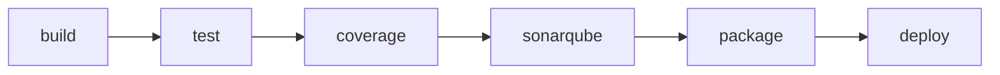

# Sample Organization Management Application

CI/CDパイプライン完全実装のサンプルアプリケーション

## 📋 プロジェクト概要

組織・部署・ユーザー管理機能を持つSpring Boot RESTful APIアプリケーション。
GitLab CI/CD、Nexus Repository、SonarQubeを使用した完全な6ステージパイプラインを実装。

### 主要機能

- 組織管理（CRUD操作）
- 部署管理（階層構造サポート）
- ユーザー管理
- RESTful API（Spring Boot 3.2）
- PostgreSQL統合
- Flyway DBマイグレーション
- 統合テスト（90%カバレッジ達成）

## 🏗️ アーキテクチャ

### マルチモジュール構成

```
sample-app/
├── common/          # 共通DTO（Lombok）
├── backend/         # Spring Boot API
│   ├── entity/      # JPA Entity
│   ├── repository/  # Spring Data JPA
│   ├── service/     # ビジネスロジック
│   └── controller/  # REST Controller
└── pom.xml          # 親POM
```

### 技術スタック

| レイヤー | 技術 | バージョン |
|---------|------|-----------|
| Backend | Spring Boot | 3.2.1 |
| Language | Java | 17 |
| Database Driver | PostgreSQL JDBC | 42.7.1 |
| Migration | Flyway | 9.22.3 |
| Build | Maven | 3.11.0 (Compiler Plugin) |
| Testing | JUnit 5 | (Spring Boot BOM) |
| Test Runner | Maven Surefire | 3.2.3 |
| Coverage | JaCoCo | 0.8.11 |
| Static Analysis | SonarQube Scanner | 3.10.0.2594 |
| Code Generation | Lombok | 1.18.30 |
| Repository | Nexus | 3.x |

## 🚀 CI/CDパイプライン

### 6ステージ構成



| ステージ | 実行内容 | 成果物 |
|---------|---------|--------|
| 🏗️ **build** | Maven コンパイル | target/classes |
| 🧪 **test** | JUnit テスト実行 | テストレポート |
| 📊 **coverage** | JaCoCo カバレッジ計測 | jacoco.xml |
| 🔍 **sonarqube** | 静的解析・品質ゲート | SonarQubeレポート |
| 📦 **package** | JAR パッケージング | *.jar |
| 🚀 **deploy** | Nexus デプロイ | maven-snapshots |

### 品質基準

- **Line Coverage**: 90%以上（JaCoCo）
- **Branch Coverage**: 90%以上（JaCoCo）
- **除外対象**: Entity, DTO（Lombok生成コード）

### パイプライン実行

```bash
cd /root/aws.git/container/claudecode/CICD
./scripts/run-sample-app-pipeline.sh
```

**パイプラインURL**: http://13.219.95.96:5003/root/sample-app/-/pipelines

## 🔧 ローカル開発環境

### 前提条件

- Java 17
- Maven 3.x
- PostgreSQL（Dockerコンテナで起動中）

### ビルド

```bash
# 全モジュールビルド
mvn clean install

# テスト実行
mvn test

# カバレッジレポート生成
mvn jacoco:report
# → backend/target/site/jacoco/index.html
```

### アプリケーション起動

```bash
cd backend
mvn spring-boot:run
```

**API エンドポイント**: http://localhost:8501

### API仕様

```bash
# 組織一覧取得
GET http://localhost:8501/api/organizations

# 組織作成
POST http://localhost:8501/api/organizations
Content-Type: application/json
{
  "name": "Example Corp",
  "code": "EXC"
}

# 組織取得
GET http://localhost:8501/api/organizations/{id}

# 組織更新
PUT http://localhost:8501/api/organizations/{id}

# 組織削除
DELETE http://localhost:8501/api/organizations/{id}
```

## 📦 Nexusデプロイ

### Maven設定

パイプラインでは自動生成されたsettings.xmlを使用：

```xml
<servers>
  <server>
    <id>nexus-snapshots</id>
    <username>admin</username>
    <password>Degital2026!</password>
  </server>
</servers>
```

### 手動デプロイ

```bash
mvn deploy -DskipTests -s ./.m2/settings.xml
```

## 🔍 SonarQube静的解析

### パイプライン実行

自動的にSonarQubeへ結果送信（パイプラインステージ4）

### ローカル実行

```bash
export EC2_PUBLIC_IP=13.219.95.96
mvn clean verify sonar:sonar \
  -Dsonar.host.url=http://${EC2_PUBLIC_IP}:8000 \
  -Dsonar.login=admin \
  -Dsonar.password=Degital2026! \
  -Dsonar.projectKey=sample-org-management
```

**SonarQube Dashboard**: http://13.219.95.96:8000/dashboard?id=sample-org-management

## 🗄️ データベース

### スキーマ構成

```sql
-- organizations テーブル
CREATE TABLE organizations (
  id BIGSERIAL PRIMARY KEY,
  name VARCHAR(255) NOT NULL,
  code VARCHAR(50) UNIQUE NOT NULL,
  created_at TIMESTAMP DEFAULT CURRENT_TIMESTAMP
);

-- departments テーブル（階層構造）
CREATE TABLE departments (
  id BIGSERIAL PRIMARY KEY,
  organization_id BIGINT REFERENCES organizations(id),
  parent_department_id BIGINT REFERENCES departments(id),
  name VARCHAR(255) NOT NULL
);

-- users テーブル
CREATE TABLE users (
  id BIGSERIAL PRIMARY KEY,
  department_id BIGINT REFERENCES departments(id),
  username VARCHAR(100) UNIQUE NOT NULL,
  email VARCHAR(255) UNIQUE NOT NULL
);
```

### Flyway マイグレーション

- **V1**: organizations テーブル作成
- **V2**: departments テーブル作成
- **V3**: users テーブル作成
- **V4**: サンプルデータ投入

### 接続情報

```yaml
spring:
  datasource:
    url: jdbc:postgresql://localhost:5001/sampledb
    username: sampleuser
    password: Degital2026!
```

## 🔐 環境変数

パイプラインで使用される環境変数：

| 変数名 | 説明 | 設定場所 |
|--------|------|---------|
| `EC2_PUBLIC_IP` | 外部IP（Nexus/SonarQube） | .gitlab-ci.yml |
| `NEXUS_ADMIN_PASSWORD` | Nexus認証パスワード | 埋め込み |
| `SONAR_TOKEN` | SonarQube API トークン | GitLab Variables |

## 📁 リポジトリ構造

```
/root/aws.git/container/claudecode/CICD/
├── sample-app/                    # サンプルアプリ（マスター）
│   ├── .gitlab-ci.yml            # CI/CD パイプライン定義
│   ├── .ci-settings.xml.template # Nexus認証設定テンプレート
│   ├── pom.xml                   # 親POM
│   ├── common/                   # 共通モジュール
│   └── backend/                  # バックエンドモジュール
└── scripts/
    └── run-sample-app-pipeline.sh # パイプライン実行スクリプト
```

### パイプライン実行フロー

1. マスターリポジトリから `/tmp/gitlab-sample-app/` へコピー
2. Git初期化 + GitLabリモート設定
3. 新規ブランチ作成（`feature/cicd-test-YYYYMMDD-HHMMSS`）
4. コミット＆プッシュ → パイプライン自動開始

## 🧪 テスト

### テストクラス

- `OrganizationServiceTest.java` - サービス層単体テスト
- `OrganizationControllerIntegrationTest.java` - Controller統合テスト

### カバレッジ除外設定

```xml
<excludes>
  <exclude>**/entity/**</exclude>
  <exclude>**/dto/**</exclude>
</excludes>
```

Lombok生成コードを除外することで、実質的なビジネスロジックのカバレッジを正確に計測。

## 🐛 トラブルシューティング

### パイプライン失敗: 401 Unauthorized

**原因**: Nexus認証設定不足

**解決**: before_scriptのsettings.xmlに`<servers>`セクション追加済み

### SonarQube接続エラー

**確認項目**:
```bash
curl -u "admin:Degital2026!" http://13.219.95.96:8000/api/system/status
```

### カバレッジ不足エラー

**対応**:
- Entity/DTO除外設定を確認
- 実装クラスに対するテストを追加

## 📚 参考リンク

- **GitLab**: http://13.219.95.96:5003/root/sample-app
- **Nexus Repository**: http://13.219.95.96:8082
- **SonarQube**: http://13.219.95.96:8000
- **PostgreSQL**: localhost:5001

## 🏷️ バージョン情報

### アプリケーション

- **GroupId**: com.example
- **ArtifactId**: sample-app-parent
- **Version**: 1.0.0-SNAPSHOT

### 依存ライブラリ

- **Spring Boot**: 3.2.1
- **Lombok**: 1.18.30
- **PostgreSQL JDBC Driver**: 42.7.1
- **Flyway Core**: 9.22.3

### Mavenプラグイン

- **Maven Compiler Plugin**: 3.11.0
- **Maven Surefire Plugin**: 3.2.3
- **JaCoCo Maven Plugin**: 0.8.11
- **SonarQube Maven Plugin**: 3.10.0.2594
- **Spring Boot Maven Plugin**: 3.2.1

### ランタイム

- **Java**: 17 (maven.compiler.source/target)
- **Encoding**: UTF-8

### CI/CD環境

- **GitLab**: Community Edition
- **Nexus Repository**: OSS 3.x
- **SonarQube**: Community Edition
- **PostgreSQL**: 15.x (Docker)

### 最終更新

- **日付**: 2026-01-11
- **Commit**: 3ac49f2
- **ステータス**: ✅ 全6ステージパイプライン動作確認済み
- **品質**: ✅ Branch Coverage 90% 達成
