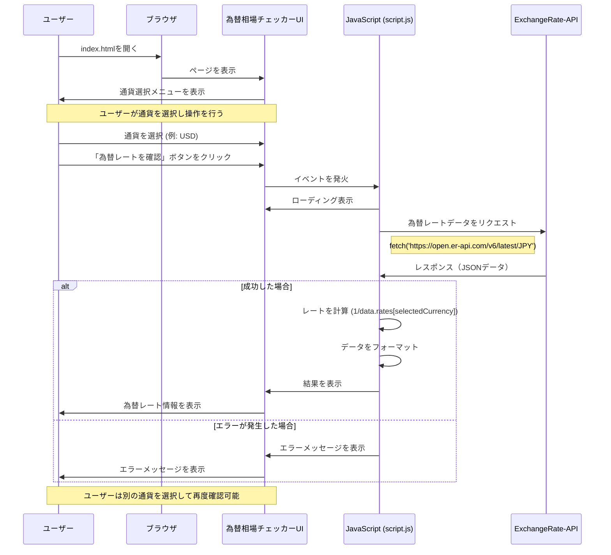

# 円の為替相場チェッカー シーケンス図

## シーケンス図の説明

1. **初期表示**:
   - ユーザーがブラウザでindex.htmlを開く
   - 通貨選択メニューとボタンが表示される

2. **ユーザー操作**:
   - ユーザーがドロップダウンメニューから通貨（USD, EUR, GBP など）を選択
   - 「為替レートを確認」ボタンをクリック

3. **データ取得**:
   - JavaScriptがイベントを検知
   - UI上にローディング表示
   - ExchangeRate-APIにHTTPリクエストを送信
   - APIからJSONデータを受信

4. **結果表示**:
   - 成功時: レート計算 → データ整形 → 結果表示
   - エラー時: エラーメッセージを表示

5. **繰り返し使用**:
   - ユーザーは別の通貨を選択して再度確認可能