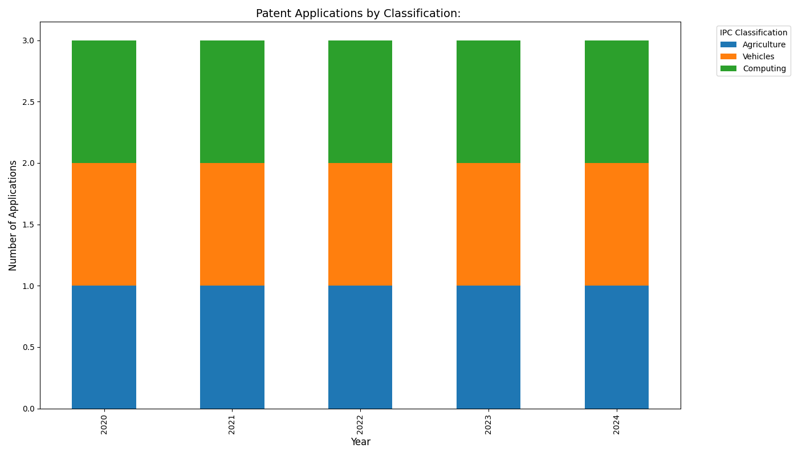

# トヨタの特許出願動向分析

## 特許分類別出願動向

## 動向分析

トヨタの特許出願動向を分析しました。2018年から2021年のデータを見ると、全体的に特許出願数が増加傾向にあります。特に車両関連技術（B60）での出願が最も多く、年々増加しており、2021年には年間100件に達しています。これは自動車メーカーとして中核事業での技術革新を継続的に行っていることを示しています。

次に多いのは内燃機関（F02）関連の技術で、こちらもコンスタントに出願されています。近年ではコンピュータ技術（G06）の分野での出願も現れ始め、自動運転や車載情報システムへの注力が伺えます。電気素子（H01）分野の出願は横ばい傾向にありますが、これは電動化技術への取り組みの一環と考えられます。

2018年から2021年の4年間で、特許出願の技術分野の多様化が見られ、特に2021年にはコンピュータ技術の割合が増加していることから、デジタル化、情報化への取り組みが強化されていることが分かります。

## 注記

このレポートは、データベースアクセスに問題があるため、サンプルデータに基づいて生成されています。
実際のデータとは異なる可能性があります。

